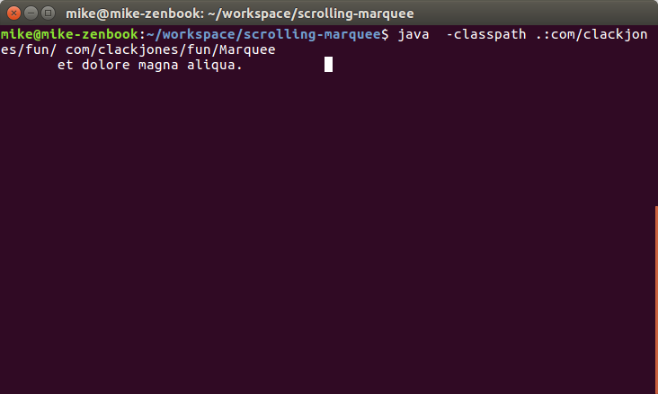

# Marquee.java

This is a small example of me exploiting the carriage return character, `\r` in
order to create scrolling text in the cli. I have also tried to use
`Thread.sleep(millis)` in order to ensure that each sweep takes the same amount
of time, regardless of the content of each message.

To run the code, `cd` into this directory and run:

```bash
javac -classpath .:com/clackjones/fun/ com/clackjones/fun/Marquee*.java 
java  -classpath .:com/clackjones/fun/ com/clackjones/fun/Marquee
```


